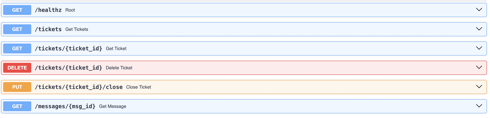
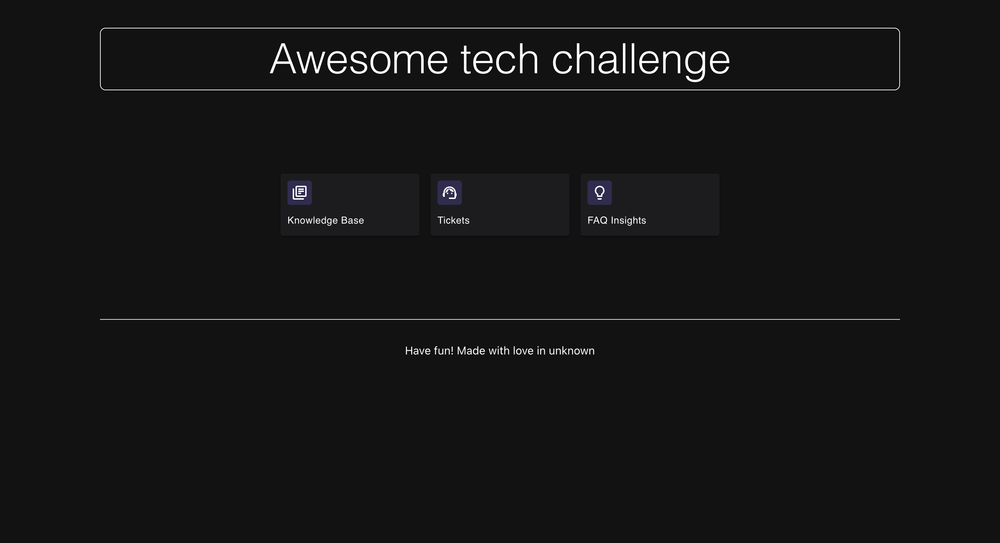
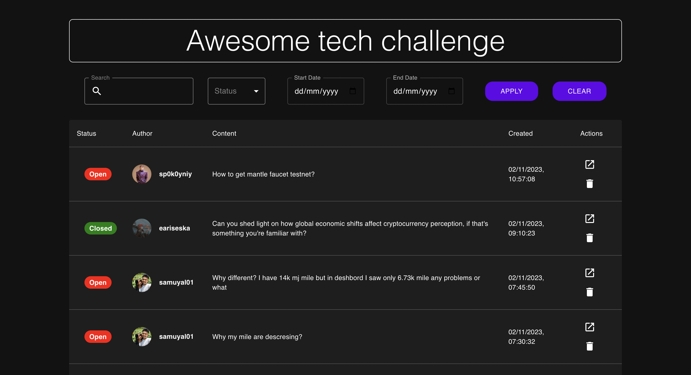
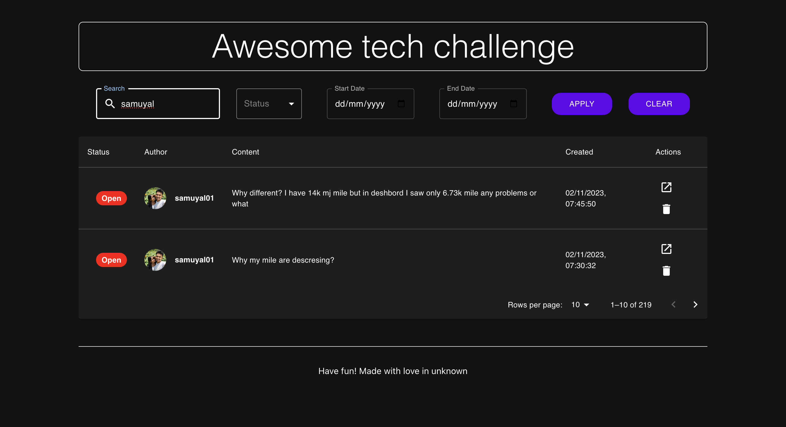
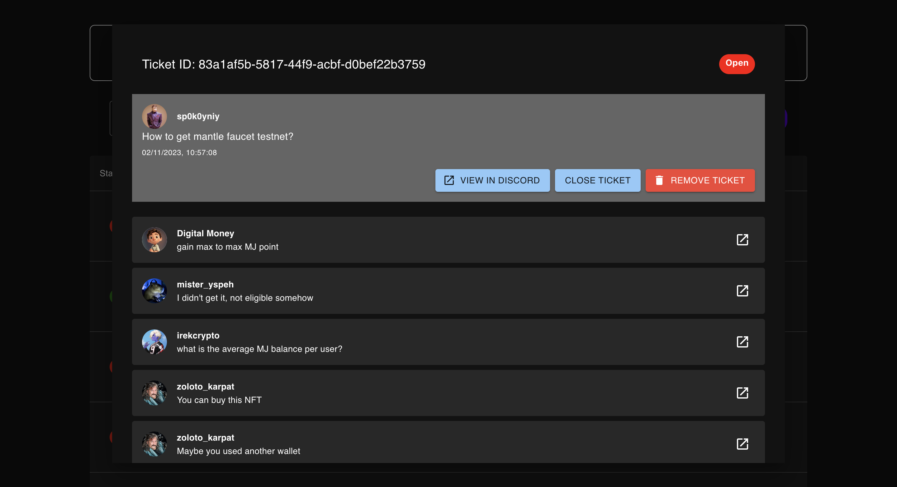

# Awesome ticket challenge

### Backend

Steps to setup the backend environment:

1. [Download the ticket data here](https://drive.google.com/file/d/1Bvk2mW5t3GfkqTkpURiFpaLuqrUckzUX/view?usp=sharing)
2. Place it in data/awesome_tickets.json
3. Run `make setup`
4. Run `make run`
5. Try it by calling [http://localhost:5001/tickets](http://localhost:5001/tickets)

### Frontend

1. Run `make setup`
2. Run `make run`
3. Open it: [http://localhost:3002](http://localhost:3002)

### Happy coding 🎉

## API Endpoints

#### `GET /healthz`
**Description:** This endpoint is used to check the health of the service.  

**Response:** Returns "OK" to indicate that the service is operational.

#### `GET /tickets`
**Description:** Retrieves a list of all tickets. It supports pagination and can filter tickets based on username, ticket status, and date range.  

**Query Parameters:**
- `page`: The page number for pagination.
- `limit`: The number of tickets to return per page.
- `username`: Filter tickets where the username contains the specified string.
- `status`: Filter tickets based on their status (e.g., "open" or "closed").
- `start_date`: The start date for filtering tickets based on their timestamp.
- `end_date`: The end date for filtering tickets based on their timestamp.
  
**Response:** A JSON object containing a slice of tickets and the total count.

#### `GET /tickets/{ticket_id}`
**Description:** Fetches a specific ticket along with the message details using its ID.  

**Path Parameters:**
- `ticket_id`: The unique identifier of the ticket to retrieve.
  
**Response:** A JSON object with the ticket's details if found, otherwise a 404 error.

#### `DELETE /tickets/{ticket_id}`
**Description:** Removes a ticket from the list of tickets. This action is non-reversible and is used to clean up tickets that are not needed anymore.  

**Path Parameters:**
- `ticket_id`: The unique identifier of the ticket to be deleted.
  
**Response:** A success message if the ticket is deleted, otherwise a 404 error if the ticket is not found.

#### `PUT /tickets/{ticket_id}/close`
**Description:** Updates the status of a ticket to "closed". This is used when a moderator resolves a ticket.  

**Path Parameters:**
- `ticket_id`: The unique identifier of the ticket to be updated.
  
**Response:** A success message if the ticket's status is updated, otherwise an error message if the operation fails.

#### `GET /messages/{msg_id}`
**Description:** Retrieves a specific message using its ID. This can be useful to fetch the content and details of a message associated with a ticket. 

**Path Parameters:**
- `msg_id`: The unique identifier of the message to retrieve.
  
**Response:** A JSON object containing the message details if found, otherwise a 404 error.

## Testing

## User Interface
### Home Page

### Ticket Page

### Ticket Page Search

### Ticket Page Detail

